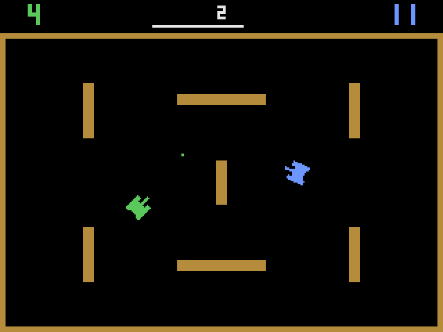

# tanques-poliglota

[](https://github.com/marciocr/tanques-poliglota/actions/workflows/test.yml)

Um duelo de tanques para dois jogadores, inspirado no **Combat** (Atari 2600,
1977), implementado em 10 linguagens sobre a **SDL2**. É o segundo jogo da série,
depois do [pong-poliglota](https://github.com/marciocr/pong-poliglota), e segue
as mesmas regras: mesmas constantes, mesmas funções (`update_tank`,
`try_move`, `draw_tank`, `noise`...) e mesmo loop com física em passo fixo, sem
nenhum arquivo externo de imagem, fonte ou som.



| Linguagem     | Pasta                | Binding SDL2                              | Build              | Executar                |
|---------------|----------------------|-------------------------------------------|--------------------|-------------------------|
| C++17         | [`cpp/`](cpp/)       | headers C oficiais                        | CMake              | `./build/tanques`       |
| Rust          | [`rust/`](rust/)     | crate `sdl2` 0.38                         | Cargo              | `cargo run --release`   |
| Go            | [`go/`](go/)         | `veandco/go-sdl2` (cgo)                   | `go.mod`           | `./tanques`             |
| D             | [`dlang/`](dlang/)   | `bindbc-sdl` 1.5 (carga dinâmica)         | dub (`dub.json`)   | `./tanques`             |
| Object Pascal | [`pascal/`](pascal/) | unit própria `sdl2mini.pas` (`external`)  | FPC via `build.sh` | `./build/tanques`       |
| Perl          | [`perl/`](perl/)     | FFI::Platypus direto na `libSDL2`         | `cpanfile`         | `./tanques.pl`          |
| Python        | [`python/`](python/) | PySDL2 (ctypes, API de baixo nível)       | `requirements.txt` | `./tanques.py`          |
| Lua (LuaJIT)  | [`lua/`](lua/)       | FFI do LuaJIT direto na `libSDL2`         | nenhum (`luajit`)  | `./tanques.lua`         |
| Java 25       | [`java/`](java/)     | API FFM (`java.lang.foreign`)             | Maven (`pom.xml`)  | `java -jar target/tanques.jar` |
| C# (.NET 10)  | [`csharp/`](csharp/) | P/Invoke com `[LibraryImport]`            | `dotnet` (`.csproj`) | `dotnet run -c Release` |

Cada pasta tem um `README.md` com as dependências e os comandos exatos de
build e execução.

## Como jogar

|                 | Jogador 1 (verde) | Jogador 2 (azul) |
|-----------------|-------------------|------------------|
| Avançar         | **W**             | **↑**            |
| Girar           | **A** / **D**     | **←** / **→**    |
| Atirar          | **Espaço**        | **Enter**        |

- **1** inicia uma partida no modo normal, e **2** no modo **ricochete**, em
  que o tiro quica nas paredes. O número do modo aparece no topo da tela.
- A partida dura **2:16**, como no Combat; a barra no topo mostra o tempo
  restante. No fim, o placar pisca.
- **Esc** sai.

## Especificação comum

- Janela 640×480. Arena com bordas e 7 obstáculos, simétrica nos dois eixos.
- Tanques giram em **16 direções** (um passo a cada 0,09 s) e andam a
  90 px/s, sem ré, como no original. Colidem com as paredes e entre si,
  deslizando ao longo delas.
- **Sprite rotacionado em código:** o tanque é definido por 4 retângulos
  (duas esteiras, corpo e canhão). Cada bloco de 2 px de uma grade 22×22
  acende se o seu centro, rotacionado de volta para o referencial do tanque,
  cai dentro da forma. O resultado tem o visual blocado do 2600 em qualquer
  direção.
- **Um tiro por tanque** de cada vez, a 320 px/s, com vida de 1,6 s. Com o
  canhão encostado numa parede, o tiro não sai.
- **Acerto:** quem atirou marca ponto. O atingido gira sozinho por 1 s e é
  empurrado na direção do tiro, sem poder ser atingido de novo nesse intervalo.
- Física em passo fixo de 1/120 s, independente do FPS. A renderização usa
  vsync.
- **Áudio sintetizado em código**, S16 mono a 44,1 kHz via `SDL_QueueAudio`:

  | Evento     | Síntese                                               |
  |------------|-------------------------------------------------------|
  | tiro       | ruído de LFSR de 16 bits, 90 ms, agudo                |
  | acerto     | ruído de LFSR, 500 ms, grave, com volume decaindo     |
  | ricochete  | onda quadrada de 1200 Hz, 25 ms                       |
  | fim        | onda quadrada de 220 Hz, 700 ms                       |

  O ruído usa um registrador de deslocamento com realimentação linear (LFSR),
  como o gerador de ruído do chip TIA do Atari.

## Equivalência entre as versões

Como o jogo não tem aleatoriedade, a mesma sequência de teclas leva ao mesmo
estado final. O `make test` aplica 7 roteiros às 10 versões (os dois modos,
tiros, acertos com empurrão, ricochetes e uma partida inteira até o fim) e exige
resultados **idênticos até a 4ª casa decimal**. Detalhes em
[`tests/README.md`](tests/README.md).

Para chegar a isso foi preciso eliminar as diferenças de ponto flutuante entre as
linguagens:

- **Direções:** as 16 direções vêm de uma tabela com senos e cossenos escritos
  como literais. O `sin`/`cos` de cada linguagem difere no último bit, e o tanque
  também anda em linha reta exata nas 4 direções cardeais.
- **Comprimento do empurrão:** `hypot` é implementado de formas diferentes em cada
  biblioteca, e virou `sqrt(x*x + y*y)`, que o IEEE 754 exige arredondado
  corretamente.
- **Pascal:** as constantes reais são `Double` tipado, porque no FPC uma constante
  sem tipo é `Extended` (veja [`pascal/README.md`](pascal/README.md)).

## Testes

```bash
make build   # compila as 10 versões, cada uma com o seu build system
make test    # equivalência entre as 10 versões, sem abrir janela
```

O teste aplica roteiros de teclas à lógica **real** de cada versão e exige que o
estado final seja idêntico, byte a byte, ao de [`tests/expected/`](tests/expected/).
O CI do GitHub Actions roda isso para cada linguagem a cada push. Detalhes em
[`tests/README.md`](tests/README.md).

## Dependências de sistema (Fedora)

Tudo está nos repositórios padrão do Fedora; não é preciso RPM Fusion nem
COPR.

```bash
sudo dnf install gcc-c++ cmake sdl2-compat-devel rust cargo golang ldc dub fpc perl perl-FFI-Platypus perl-FFI-CheckLib python3 python3-pysdl2 luajit java-25-openjdk-devel maven dotnet-sdk-10.0
```

## Créditos

Inspirado no Combat (Atari, 1977), que por sua vez veio do fliperama Tank
(Kee Games, 1974). Combat é marca registrada da Atari; este é um projeto
independente, sem código nem arte do original.
